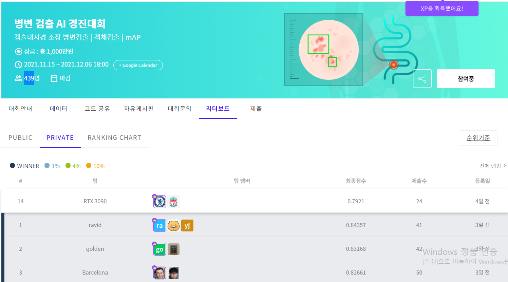

# Dacon 병변 검출 AI 경진대회
## Dacon Capsule endoscopy small intestine lesion detection AI Competition

대회 개요

2000년대 이후 상용화 되어 현재 활발하게 시행중인 캡슐 내시경!

캡슐 내시경은 최소 침습 내시경으로 알약을 삼킬 수 있는 어린이 부터 노인에 이르기 까지 가장 손쉽게 소장의 병변을 찾아낼 수 있는 내시경입니다. 캡슐 내시경에서 정확하게 병변을 찾아내는 병변 검출은 크론병을 비롯한 소장 질환 진단을 위해 매우 중요합니다.하지만 촬영 시간이 길어서 판독에 전문가의 고도의 집중력과 시간 투자가 필요합니다. 

캡슐 내시경에서 AI 가 정확하고 손쉽게 병변을 검출해 준다면, 의료진들에게 매우 큰 도움이 될 것입니다.

캡슐내시경 병변을 AI로 찾아내기 위해 '한국지능정보사회진흥원'과 '양산부산대학교병원'은 의료 현장에서 촬영되는 캡슐 내시경 이미지 데이터셋을 구축하였습니다.

구축된 데이터셋을 활용하여 정확한 진단이 가능한 AI를 만들어주세요.

## 최종 순위 14위 / 439팀 - Top 3%

